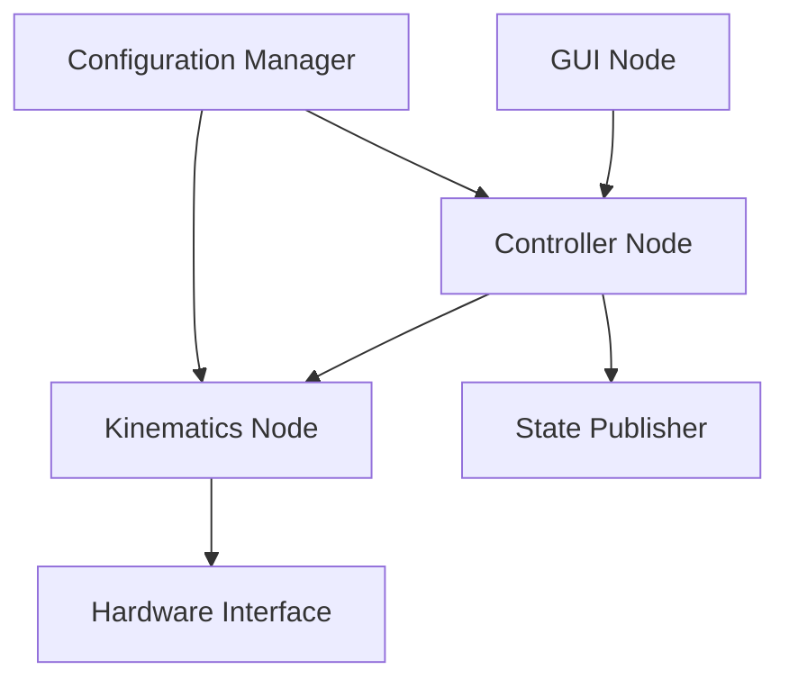

# Cable Robot Project Documentation

## Project Overview
This project implements a Cable-Driven Parallel Robot (CDPR) system in ROS2. The system is designed with modularity in mind, separating core functionality, hardware interfaces, simulation capabilities, and user interfaces into distinct packages.

## Project Structure

### Directory Tree
```
cable_robot_ws/
├── src/
│   ├── cable_robot_bringup/           # Launch package
│   │   ├── package.xml
│   │   ├── CMakeLists.txt
│   │   └── launch/
│   │       ├── robot.launch.py        # Real hardware
│   │       ├── simulation.launch.py    # Gazebo simulation
│   │       ├── demo.launch.py         # Demo configurations
│   │       └── test.launch.py         # Testing configurations
│   │
│   ├── cable_robot_interfaces/        # Interface definitions
│   │   ├── package.xml
│   │   ├── CMakeLists.txt
│   │   ├── msg/
│   │   │   ├── RobotState.msg
│   │   │   ├── CableTension.msg
│   │   │   ├── EndEffectorPose.msg
│   │   │   └── SystemConfig.msg
│   │   └── srv/
│   │       ├── UpdateConfig.srv
│   │       ├── ControlMode.srv
│   │       └── CalibrationService.srv
│   │
│   ├── cable_robot_core/             # Core functionality
│   │   ├── package.xml
│   │   ├── CMakeLists.txt
│   │   ├── include/
│   │   │   └── cable_robot_core/
│   │   │       ├── kinematics/
│   │   │       │   ├── forward_kinematics.hpp
│   │   │       │   └── inverse_kinematics.hpp
│   │   │       ├── controllers/
│   │   │       │   ├── tension_controller.hpp
│   │   │       │   └── trajectory_controller.hpp
│   │   │       └── utils/
│   │   │           ├── math_utils.hpp
│   │   │           └── configuration.hpp
│   │   └── src/
│   │       ├── nodes/
│   │       │   ├── kinematics_node.cpp
│   │       │   └── controller_node.cpp
│   │       └── lib/
│   │           ├── kinematics.cpp
│   │           └── controllers.cpp
│   │
│   └── [Additional packages...]
```

## Package Details

### 1. cable_robot_bringup
Launch package containing various launch configurations for different scenarios.

**Key Components:**
- `robot.launch.py`: Launches the system with real hardware
- `simulation.launch.py`: Launches Gazebo simulation
- `demo.launch.py`: Demo configurations for presentations
- `test.launch.py`: Testing configurations

### 2. cable_robot_interfaces
Defines all ROS2 messages and services used throughout the system.

**Messages:**
- `RobotState.msg`: Current state of the robot
  ```
  Header header
  EndEffectorPose pose
  CableTension[] cable_tensions
  ```
- `CableTension.msg`: Cable tension data
  ```
  float64 tension
  uint8 cable_id
  bool tension_valid
  ```
- `EndEffectorPose.msg`: End effector position and orientation
  ```
  geometry_msgs/Pose pose
  geometry_msgs/Twist velocity
  ```
- `SystemConfig.msg`: System configuration parameters

**Services:**
- `UpdateConfig.srv`: Service to update system parameters
- `ControlMode.srv`: Switch between control modes
- `CalibrationService.srv`: Robot calibration service

### 3. cable_robot_core
Core functionality including kinematics and control algorithms.

**Kinematics:**
- Forward kinematics: Calculates end-effector pose from cable lengths
- Inverse kinematics: Determines required cable lengths for desired pose

**Controllers:**
- Tension controller: Maintains proper cable tension
- Trajectory controller: Manages end-effector movement

### 4. cable_robot_description
Robot description package containing URDF and configuration files.

**Key Components:**
- `cable_robot.urdf.xacro`: Main robot description
- Component XACROs:
  - `frame.xacro`: Robot frame structure
  - `cable.xacro`: Cable properties and attachment points
  - `end_effector.xacro`: End effector description
  - `pulley.xacro`: Pulley system description

### 5. cable_robot_gazebo
Simulation package for Gazebo integration.

**Features:**
- Custom cable physics plugin
- Simulated sensor interfaces
- Testing environments

### 6. cable_robot_hardware
Hardware interface package for real robot control.

**Components:**
- Motor controller interface
- Sensor integration
- Real-time control loop implementation

### 7. cable_robot_gui
User interface package for robot control and monitoring.

**Features:**
- Real-time status monitoring
- Manual control interface
- Configuration management
- Visualization tools

## System Architecture

### Node Structure


### Communication Flow
1. User input from GUI → Controller Node
2. Controller Node computes desired cable tensions
3. Kinematics Node calculates required motor positions
4. Hardware Interface executes commands
5. Feedback loop through State Publisher

## Build and Run Instructions

### Prerequisites
```bash
# ROS2 dependencies
sudo apt install ros-humble-xacro ros-humble-controller-manager

# Additional dependencies
sudo apt install python3-colcon-common-extensions
```

### Building the Project
```bash
# Clone the repository
git clone <repository_url> ~/cable_robot_ws
cd ~/cable_robot_ws

# Install dependencies
rosdep install --from-paths src --ignore-src -r -y

# Build the workspace
colcon build
```

### Running the System

#### Real Hardware
```bash
source install/setup.bash
ros2 launch cable_robot_bringup robot.launch.py
```

#### Simulation
```bash
source install/setup.bash
ros2 launch cable_robot_bringup simulation.launch.py
```

## Configuration

### Robot Configuration
Basic configuration is stored in `config/robot_configs/default_setup.yaml`:
```yaml
cable_robot:
  frame:
    dimensions: [2.0, 2.0, 2.0]  # x, y, z in meters
  cables:
    count: 8
    default_tension: 50.0  # N
  control:
    update_rate: 100  # Hz
```

### Controller Configuration
PID gains and other control parameters in `config/controller_configs/pid_gains.yaml`:
```yaml
tension_controller:
  p_gain: 0.5
  i_gain: 0.1
  d_gain: 0.05
```

## Development Guidelines

### Code Style
- Follow ROS2 coding guidelines
- Use clang-format for C++ code
- Use flake8 for Python code

### Testing
1. Unit tests for all core functionality
2. Integration tests for node communication
3. System tests for full robot operation

### Contributing
1. Fork the repository
2. Create a feature branch
3. Submit a pull request with clear description
4. Ensure all tests pass
5. Follow code review process

## Troubleshooting

### Common Issues
1. Cable tension calibration errors
2. Communication timeouts
3. Simulation physics instability

### Debug Tools
- ROS2 topic echo for message monitoring
- rqt_graph for system visualization
- Gazebo GUI for simulation debugging

## Future Development

### Planned Features
1. Advanced trajectory planning
2. Dynamic obstacle avoidance
3. Multi-robot coordination
4. Machine learning integration

### Performance Optimization
1. Real-time control improvements
2. Simulation accuracy enhancement
3. GUI responsiveness optimization
